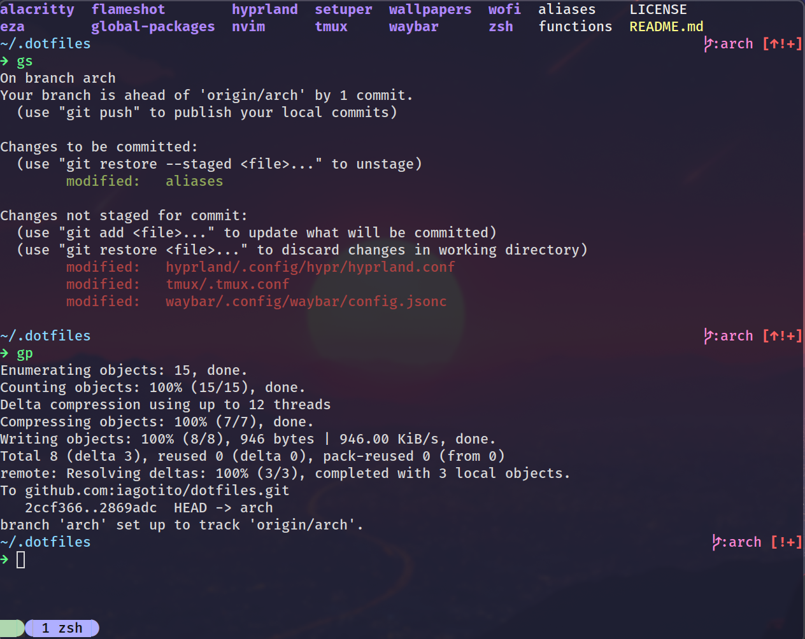
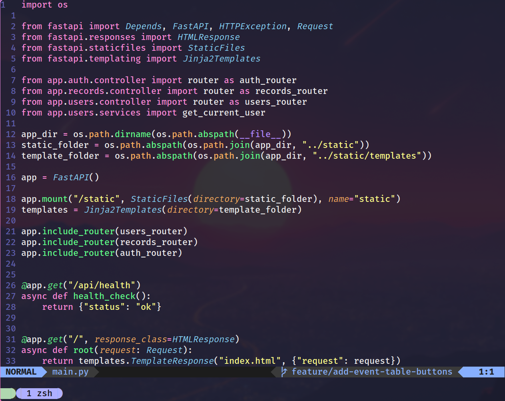

# Iago's Dotfiles

My attempt to create some nice dotfiles to me. Includes configuration
files for a customized Linux environment, especially settings for
terminal, tmux, and desktop environment, including configurations for
Alacritty, Hyprland, Waybar, and more.

## Screenshots

Terminal

Neovim

## Usage

Clone the repository and use the setuper script to apply
configurations. Refer to individual directories for specific program
settings.

## License

MIT License. See LICENSE for details.
